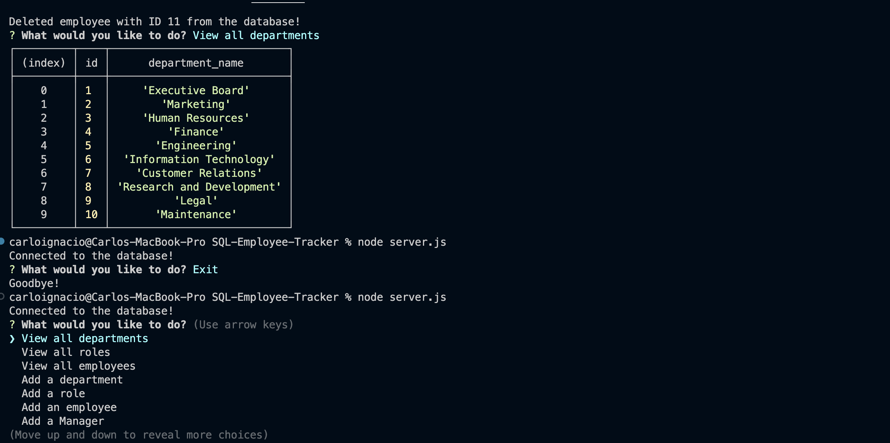

# SQL-Employee-Tracker

## Description
This app is a command line program that stores, adds, updates, and deletes employee records from a database. It produces tables that contain employees, managers, departments, salaries, as well as employee roles and who they are managed by. In this program, you are able to manage and edit each of those categories.

## Technologies Used

JavaScript  
Node.js  
Inquirer.js  
mysql2  

## Installation

-Clone the repository: https://github.com/casignacio/SQL-Employee-Tracker

-Install the following using npm install:
    Node.JS  
    Inquirer.js  
    mysql2  

## Usage

To use this app, please download node, mysql2, and inquirer using npm install. After the packages are properly installed then run node.js in the intergrated terminal for the repository and follow the prompts. You are able to view and manage all aspects of the company through the command line terminal.

## Screenshots

## Video Link

https://drive.google.com/file/d/1_ms3mI4UXG1r3TknTFwSC97gYOFEuOJj/view